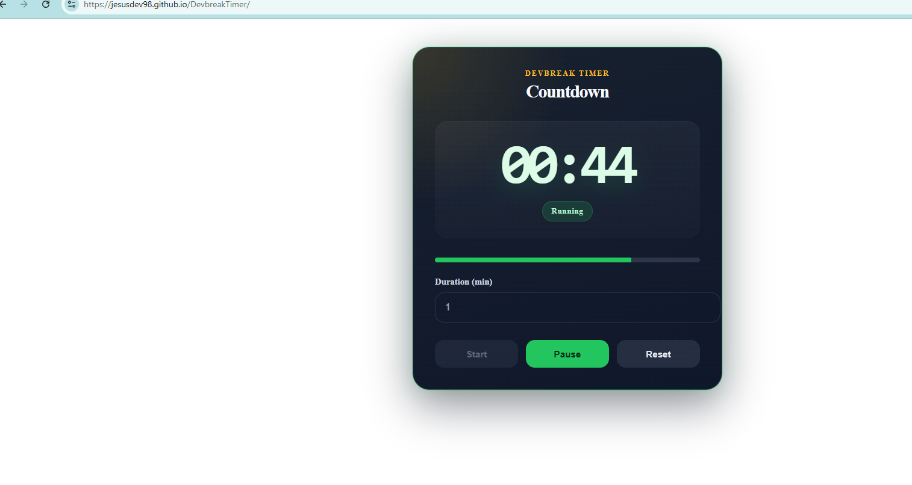
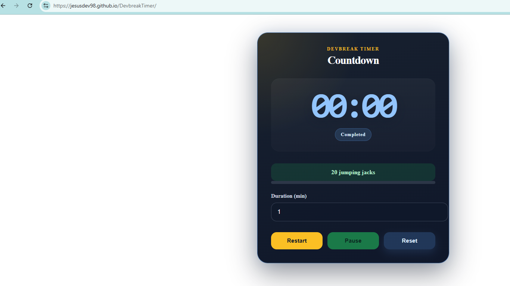

# DevBreak Timer

Angular productivity timer for focused work sessions, reactive state handling, and polished break feedback.

## Live Demo

https://jesusdev98.github.io/DevbreakTimer/

## Overview

DevBreak Timer is a countdown app built for developers and knowledge workers who want a simple focus tool without extra setup.
It covers the full session flow, keeps state reactive, and adds a small break ritual when the timer ends.

## Features

- Smart countdown with `start`, `pause`, `resume`, and `reset`
- Dynamic time formatting from `mm:ss` to `hh:mm:ss`
- Progress bar synced with remaining time
- Browser notification and completion sound
- Random break exercise suggestion after each session
- Reactive state management with RxJS `BehaviorSubject`
- Safe `localStorage` persistence with validation
- Modern dark UI built with SCSS

## Preview




## Tech Stack

- Angular 21
- TypeScript
- RxJS
- SCSS

## Run Locally

```bash
npm install
ng serve
```

## Technical Highlights

- Timer state isolated in a dedicated service
- `BehaviorSubject` keeps the UI in sync with the latest value
- Defensive parsing protects against invalid persisted state
- Presentation logic stays separate from timer and storage rules
- Completion effects are triggered at the component layer, not inside the core timer state

## Future Improvements

- Presets for common focus cycles such as Pomodoro
- Settings panel for duration and notification preferences
- Custom sound selection
